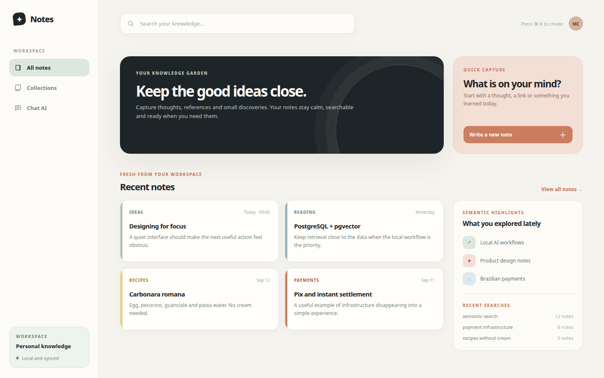
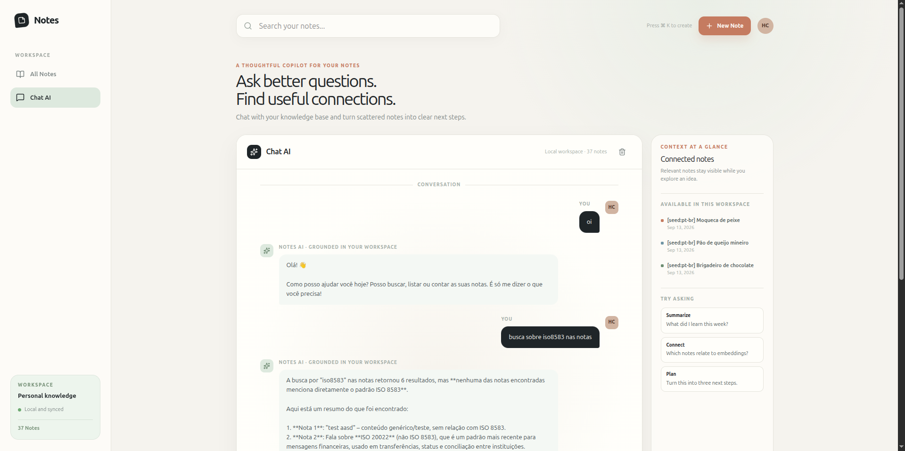

# Notes CRUD - FastAPI

[🇺🇸 Read this README in English](README.md)

Aplicação de notas com busca semântica usando React, FastAPI, PostgreSQL/pgvector
e Ollama. O fluxo local principal funciona inteiramente com a stack FastAPI.

O backend Supabase anterior continua disponível em um fluxo separado. Consulte o
[README do Supabase](README-supabase.md) quando precisar dele.

## Screenshots





## Requisitos

- [Docker](https://www.docker.com)
- Node.js e pnpm
- Python 3.11+ somente para scripts ou testes locais

## Início rápido

Na raiz do projeto, configure o backend uma vez:

```bash
cp server/.env.example server/.env
```

Adicione sua chave Groq em `server/.env` se quiser usar o Chat AI:

```env
GROQ_API_KEY=sua_chave_groq
```

Instale as dependências do frontend e suba todo o ambiente local:

```bash
cd web
pnpm install
cd ..
bash scripts/start-fastapi.sh
```

O script inicia PostgreSQL/pgvector, Ollama, FastAPI e o frontend Vite. Ele também
baixa `qwen3-embedding:4b` quando necessário.

- Aplicação: http://localhost:5173
- Documentação da API: http://127.0.0.1:8003/docs

Pressione `Ctrl+C` para desligar os serviços iniciados pelo script. Os dados do
PostgreSQL local ficam persistidos em `.docker/postgres_data`.

Se precisar somente dos serviços do backend em segundo plano:

```bash
docker compose up -d postgres ollama server
docker exec notes-ollama ollama pull qwen3-embedding:4b
```

## Chat AI

Quando `CHAT_PROVIDER` não está definido, o backend usa o Groq automaticamente se
`GROQ_API_KEY` estiver disponível, com o modelo `qwen/qwen3.8-27b`. Use
`CHAT_PROVIDER` e `GROQ_MODEL` para substituir essa configuração. Nunca exponha a
chave no frontend nem faça commit dela.

Se a comunicação com o assistente falhar, a interface mantém a mensagem enviada e
exibe: “Não consegui me conectar com o assistente. Verifique a conexão e tente
novamente.”

## Seed de notas

Com os serviços locais rodando, popule a fixture em português (36 notas com
embeddings reais do Qwen):

```bash
bash scripts/seed_notes_fastapi.sh --reset
```

Remova somente as notas da fixture quando terminar:

```bash
bash scripts/seed_notes_fastapi.sh --cleanup
```

A forma Python oferece as mesmas operações e permite um prefixo personalizado:

```bash
python3 scripts/seed_notes.py --backend fastapi --reset
python3 scripts/seed_notes.py --backend fastapi --prefix "[e2e:pt-br]" --reset
python3 scripts/seed_notes.py --backend fastapi --prefix "[e2e:pt-br]" --cleanup
```

Consultas úteis para testar a busca semântica incluem `banco central`,
`split payment`, `random key` e `barcode`.

## Testes

Testes unitários e build de produção:

```bash
cd web
pnpm test:run
pnpm build
```

Com o ambiente FastAPI em execução, rode os testes Playwright em outro terminal:

```bash
cd web
pnpm test:e2e
```

A suíte E2E cobre o tratamento de falha do Chat AI e a limpeza da busca semântica.

## Estrutura do projeto

```text
server/          API FastAPI, acesso ao PostgreSQL e configuração do chat
web/             Frontend React + TypeScript
postgres/init/   Schema PostgreSQL + pgvector
scripts/         Seeders locais, scripts de inicialização e limpeza
supabase/        Backend Supabase preservado; veja README-supabase.md
```

## Tecnologias

FastAPI · PostgreSQL/pgvector · Ollama · React · TypeScript · Vite · Tailwind CSS
